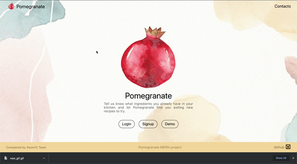
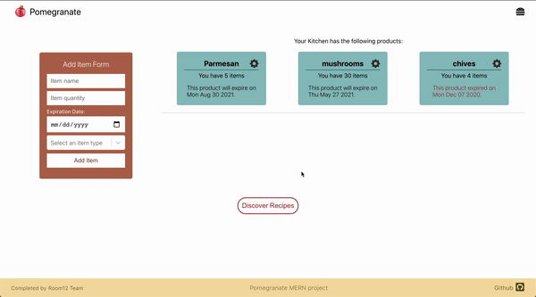
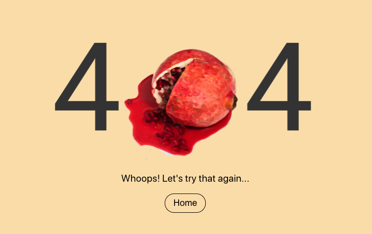
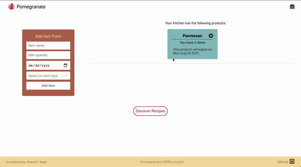

<div align="center">
  <a href="https://aapomegranate.herokuapp.com/">Live Site</a>
</div>
          
          
Let Pomegranate help you discover exciting new meals you can create with the ingredients you already have. Give us an idea of what you've got to work with and let Pomegranate do the rest! Convenient, green, accessible. Pomegranate.


# Background and Overview

If given a choice between a healthy, convenient, delicious home-cooked meal and eating out, most people would choose the former. COVID has dramatically accelerated this movement. Even people who didn't have an interest in cooking find themselves subscribing to meal kits and learning how to cook a meal. It has become a necessity. However most people find themselves wasting almost 40% of everything they buy because they don't know what to do with it. This app takes the hard work out of the equation by suggesting exciting ways to prepare those leftovers you might otherwise throw out.

# Technologies Stack

* MongoDB
* NoSQL Database
* Javascript
* React/Redux
* Google Maps Javascript API
* Spoonacular API

# Functionality and MVP

* Complete User Authentication Experience
* Kitchen Inventory Management
* Generate Recipes Based on Inventory
* Locate Nearby Grocery Stores

# Technologies and Challenges


## User Authentication

Visitors are prompted to sign up or log in on our splash page. Pomegranate utilizes BCrypt to salt and encrypt a user's password into our database for added security. Validation errors are displayed if a user provides incorrect credentials.



## Kitchen Inventory

After logging in, the user can add items to their kitchen with Pomegranate's 'Add Item Form.' The Kitchen can keep track of what items are available to use in its recipe generator after the user inputs the item's name, quantity, expiration date, and selects an option from the item type drop-down. If an item expires, Pomegranate will display it in red. We also allow a user to update each item's information by utilizing the edit modal.



## Recipe Generator
After adding the items, a user can click the 'Generate Recipe' button. Based on the ingredients in a user's kitchen, Pomegranate finds recipes using the Spoonacular API, then displays those recipes in meaningful, user-friendly ways. Each recipe can be clicked to show cooking instructions in greater detail. Underneath each recipe will be a list of items it would use from the kitchen, and the items (if any) a user would have to purchase. In the recipe show page, a user can click a button to automatically decrement items in their kitchen to reflect their updated inventory and display a "Low Inventory" warning if applicable.

## Google Maps
In case a user needs to purchase an ingredient or two to cook one of Pomegranate's recipes, the app can use the Google Maps API to locate nearby grocery stores.

## Page Not Found - 404 Error
Users are redirected to a custom 404 page if they try to access a non-existent URL.
<div>
  
</div>
<p>&nbsp;</p>

# Code Highlights
## Modals
Below, you can see how we allow a user to easily edit items in their kitchen. This modal, like our user login demonstrated above, allows for a smooth UI/UX. Here, we render the edit container based on the modal 'edit' type under case 'edit'. In the future, more cases could be added under the switch. The modal automatically closes if the user either clicks outside of the form or on 'X'. 



```javascript
function Modal({ modal, closeModal }) {
    if (!modal) {
        return null;
    }
    let component;
//*********** YOU HAVE ACCESS TO THE USER ID USING modal.userId ****************//
    switch (modal.modal) {
        case 'edit':
            component = <ItemEditContainer />;
            break;
        default:
            return null;
    }
    return (
        <div className="modal-background" onClick={closeModal}>
            <div className="modal-child" onClick={e => e.stopPropagation()}>
                {component}
            </div>
        </div>
    );
}

const mapStateToProps = state => {
    return {
        modal: state.ui.modal
    };
};
const mapDispatchToProps = dispatch => {
    return {
        closeModal: () => {
            dispatch(closeModal());
        },
    };
};
export default connect(mapStateToProps, mapDispatchToProps)(Modal);
```
## Styling

Out top priority was to make Pomegranate elegant and functional. Our home page utilizes CSS positioning strategies to add a beautiful background image.
### Home Page
```javascript
.splash-container{
    height:100vh;
    width:100%;
    position:relative;
} 
.splash-container::before{
    content:'';
    position:absolute;
    background-image: url(../../images/back3.jpg);
    background-repeat: no-repeat;
    background-size: cover;
    z-index: -1;;
    opacity:0.4;
    width : 100%;
    height: 100%
}
```
We used SCSS throught the project for better CSS structuring and readability. Smooth transitions were used for every hover effect and modal.

### Recipes Section
```javascript
.recipes-container{
    width:100%;
    margin:50px 0;
    .fetch-rec-button-box{
        width:100%;
        display: flex;
        flex-direction: column;
        align-items: center;
        justify-content: center;
        margin-bottom:70px;
        button{
            padding:10px;
            border-radius:30px;
            border:2px solid $mainRed;
            background:white;
            transition: ease-out all 0.2s;
            color:$mainRed;
            font-size:18px;
            &:hover{
                background: $mainRed;
                color:white;
                border: 2px solid $mainRed;
                cursor:pointer;
            }
        }
    }
    .recipes-box{
        margin: 0 100px;
        display: flex;
        flex-wrap: wrap;
        align-items: start;
        justify-content: space-between;
        .recipe-card{
            box-shadow: 0 2px 5px rgba(0,0,0,0.1);
            border-radius: 5px;
            width:20%;
            margin:20px;
            .recipe-image-box{
                width:100%;
                img{
                    width:100%;
                    position:top;
                    object-fit: cover;
                }

            }
            .card-info{
                padding:10px;
                .recipe-title-box{
                    font-size: 20px;
                    margin-bottom: 10px;
                }
                .from-kitchen-box{
                    margin-bottom:5px;
                    .kitchen-item-yes{
                        color:$mainGreen;
                        font-size:16px;
                    }
                }
                .missing-items-box{
                    .kitchen-item-no{
                        color:$mainRed;
                        font-size:16px;
                    }
                }
            }
        }
    }
}
```
