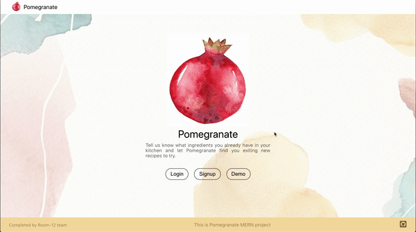
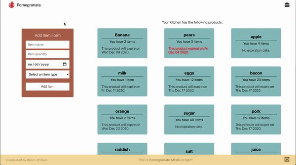

Let Pomegranate help you discover exciting new meals you can create with the ingredients you already have. Give us an idea of what you've got to work with and let Pomegranate do the rest! Convenient, green, accessable. Pomegranate.

# Background and Overview

If given a choice between a healthy, convenient, delicious home-cooked meal and eating out, most American's would choose the former. COVID has dramatically accelereated this movement. Even people who didn't have an interest in cooking find themselves subscribing to meal kits and learning how to cook a meal. It's become a necessity. However most people find themselves wasting almost 40% of everything they buy because they don't know what to do with it. Why bother finding a recipe to cook that leftover tomoato from yesterday's stew and the asperagas you only bought because it was on sale at Trader Joe's. This app takes the hard work out of the equation by suggesting exciting ways to prepare those leftovers you might otherwise throw out.

# Technologies Stack

* MongoDB
* NoSQL Database
* Javascript
* React/Redux
* Google Maps Javascript API
* Spoonacular API

# Functionality and MVP

* Complete User Authentication Experience
* Kitchen Inventory Management
* Generate Recipes Based on Inventory
* Locate Nearby Grocery Stores

# Technologies and Challenges

## MongoDB and Express

Here, we stored all user login information, their kitchen info, and all ingredients in their kitchen. When they input each ingredient, we keep track of which items have expired and display them in red in the kitchen show page. We also allow a user to update each ingredients information in an ingredient show page. 

## React, Redux, Node

We created smooth, clean modals to input user and ingredient data. We also used it to create get requests to our Spoonacular and Google APIs and then display that information in meaningful, user-friendly ways. We can suggest recipes the user can use based on the ingredients in their kitchen, show each recipe in greater detail, and even locate nearby grocery stores with Google Maps if a user is missing any ingredients for a suggested recipe. We even keep track of each ingredient's expiration date and show it in red if it has expired.

